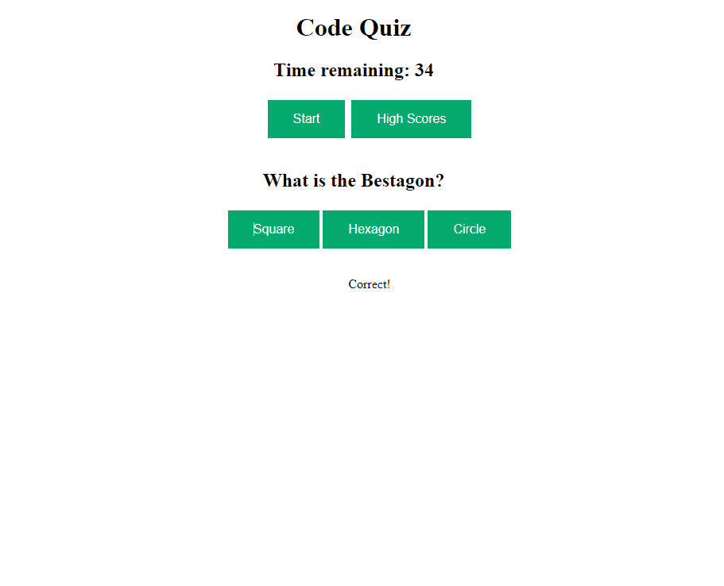

# Coding Quiz

## Description

This webpage is a short quiz that will store the user's score in local memory and retrieve to display the high scores.

## Usage

- Click "Start"
- Click an answer for each question, score goes up by 1 for each correct answer
- Incorrect answers will subtract time from the clock
- At the end of the questions or when time runs out, enter your initials and submit to save your high score
- Click "High Scores" to display the high scores
- Click "Play Again" to play again

https://scook9.github.io/module-4-code-quiz  
https://github.com/scook9/module-4-code-quiz

## Credits

Starting index.html and style.css from course exercise "17-Ins_Event-Bubbling"  
HTML structure for start button, dynamically creating elements referenced from "28-Stu_Mini-Project"  
Clearing answer buttons in JS taken from MDN https://developer.mozilla.org/en-US/docs/Web/API/Node/removeChild  
Timer used from 04-Web-APIs/09-Ins_Timers-Intervals  
High scores form used from W3Schools https://www.w3schools.com/html/tryit.asp?filename=tryhtml_form_submit  
.button CSS from https://www.w3schools.com/css/tryit.asp?filename=trycss_buttons_basic
